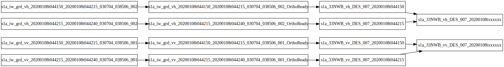

.. include:: <isoamsa.txt>

.. _dataflow:

.. index:: data flow

======================================================================
Data flow
======================================================================

.. contents:: Contents:
   :local:
   :depth: 3

Overall processing
------------------

S1 Tiling processes by looping on all required S2 tiles within the time range.

For each S2 tile,

1. It :ref:`downloads <downloading>` the necessary S1 images that intersects
   the S2 tile, within the specified time range, that are not already available
   in :ref:`input data cache <paths.s1_images>`

2. Then, for each polarisation,

   1. It :ref:`calibrates <calibration>`, :ref:`cuts <cutting>` and
      :ref:`orthorectifies <orthorectification>` all the S1 images onto the S2
      grid
   2. It :ref:`superposes (concatenates) <concatenation>` the orthorectified
      images into a single S2 tile.
   3. It :ref:`builds masks <mask-generation>`, :ref:`if required <Mask.generate_border_mask>`

.. _parallelization:

.. index:: parallelization

Parallelization
---------------

The actual sequencing is not linear. S1 Tiling starts by building a
dependencies graph expressed as a Dask Tasks graph. Dask framework then takes
care of distributing the computations.

In the following processing of 33NWB from 2020-01-01 to 2020-01-10, only one S2
image is generated. It's done by processing in parallel (but in any order
compatible with the dependencies represented in the graph),

- the S1 image inputs (first row) by :ref:`calibrating <calibration>` and
  :ref:`cutting <cutting>` them to obtain...
- the :ref:`orthoready files <orthoready-files>` (second row), which are in
  turn :ref:`orthorectified <orthorectification>` to obtain...
- the :ref:`orthorectified files <orthorectified-files>` (third row), which are
  in turn :ref:`concatenated <concatenation>` to obtain...
- the :ref:`final S2 products <full-S2-tiles>` (fourth row),
- :ref:`border masks <mask-files>`  can in turn be :ref:`generated
  <mask-generation>` from them -- not represented on the graph.

.. _processings:

The processings
---------------

.. _downloading:

.. index:: downloading

Downloading of S1 products
++++++++++++++++++++++++++

The downloading on S1 products is optional and done only if
:ref:`[DataSource].download <DataSource.download>` option is set to ``True``.

S1 products are downloaded with `eodag <https://github.com/CS-SI/eodag>`_.
See :ref:`[DataSource].eodag_config <DataSource.eodag_config>`  regarding its
configuration.

Downloaded files are stored into the directory specified by
:ref:`[Paths].s1_images <Paths.s1_images>` option. If the directory doesn't
exist, it's created on the fly.

.. _calibration:

.. index:: SAR Calibration

SAR Calibration
+++++++++++++++

σ, or γ radiometric correction is applied thanks to :std:doc:`OTB
SARCalibration application <Applications/app_SARCalibration>`.

The type of calibration is controlled with :ref:`[Processing].calibration
<Processing.calibration>` option. It also permits to remove thermal noise
:ref:`if required <Processing.remove_thermal_noise>`.

.. note:: At the end of this step, no file is produced as calibration is piped
   in memory with :ref:`cutting <cutting>` to produce :ref:`orthorectification
   ready images <orthoready-files>`

.. _cutting:

.. index:: Margin cutting

Margins cutting
+++++++++++++++

This step takes care of resetting margins content to 0 when too many no-data
are detected within the margin. This phenomenon happens on coasts. The margins
aren't cut out like what :std:doc:`ExtractROI <Applications/app_ExtractROI>`
would do but filled with 0's, which permits to keeps the initial geometry.

This step is done with :std:doc:`OTB ResetMargin application
<Applications/app_ResetMargin>`.

The implemented heuristic is to always cut 1000 pixels on the sides (2 x 10
km), and 1600 pixels (16km) on the top (/resp on the bottom) of the image if
more than 2000 NoData (NoData is assimilated with 0 here) pixels are detected
on the 100th row from the top (/resp from the bottom).

.. note::
   The heuristic can be overridden thanks
   :ref:`[Processing].override_azimuth_cut_threshold_to
   <Processing.override_azimuth_cut_threshold_to>` option.

At the end of this step, :ref:`orthorectification ready images
<orthoready-files>` may be produced. It could be interresting to :ref:`cache
<data-caches>` these product as a same cut-and-calibrated S1 image can be
orthorectified into several S2 grids it intersects. The default processing of
these products in memory can be disabled by passing ``--cache-before-ortho`` to
program:`S1Processor`.

.. _orthorectification:

.. index:: Orthorectification

Orthorectification
++++++++++++++++++

This steps ortho-rectifies the cut and calibrated (aka "orthoready") image in
S1 geometry to S2 grid.

This step is done with :std:doc:`OTB OrthoRectification application
<Applications/app_OrthoRectification>`.

It uses the following parameters from the request configuration file:

- :ref:`[Processing].orthorectification_gridspacing
  <Processing.orthorectification_gridspacing>`
- :ref:`[Processing].orthorectification_interpolation_method
  <Processing.orthorectification_interpolation_method>`
- :ref:`[Paths].srtm <paths.srtm>`
- :ref:`[Paths].geoid_file <paths.geoid_file>`

At the end of this step, :ref:`orthorectified S1 images
<orthorectified-files>` are produced.

.. _concatenation:

.. index:: Concatenation

Concatenation
+++++++++++++

This step takes care of merging all the images of the orthorectified S1
products on a given S2 grid. As all orthorectified images are almost exclusive,
they are concatenated by taking the first non null pixel.

This step is done with :std:doc:`OTB Synthetize application
<Applications/app_Synthetize>`.

This step produces the main product of S1 Tiling: the :ref:`final S2 tiles
<full-S2-tiles>`.

.. list-table::
  :widths: auto
  :header-rows: 0
  :stub-columns: 0

  * - .. image:: _static/concat.jpeg
           :scale: 50%
           :alt:   Two orthorectified and exclusive S1 images
           :align: right

    - |Rarrtl|

    - .. image:: _static/s1a_33NWB_vh_DES_007_20200108txxxxxx.jpeg
           :scale: 50%
           :alt:   The orthorectified result
           :align: left

.. _mask-generation:

.. index:: Border mask generation

Border mask generation
++++++++++++++++++++++

If :ref:`requested <Mask.generate_border_mask>`, :ref:`border masks
<mask-files>`  are generated.

The actual generation is done in two steps:

1. :std:doc:`OTB BandMath application <Applications/app_BandMath>` is used to
   generate border masks by saturating non-zero data to 1's.
2. :std:doc:`OTB BinaryMorphologicalOperation application
   <Applications/app_BinaryMorphologicalOperation>` is used to smooth border
   masks with a ball of 5x5 radius used for *opening*.

This step produces the :ref:`border mask files <mask-files>`.

.. _data-caches:

.. index:: Data caches

Data caches
-----------

Two kinds of data are cached, but only one is regularly cleaned-up by S1
Tiling. The other kind is left along as the software cannot really tell whether
they could be reused later on or not.

.. important:: This means that you may have to regularly clean up this space.

.. _cache.S1:

Downloaded S1 files
+++++++++++++++++++

S1 files are downloaded in :ref:`[Paths].s1_images <Paths.s1_images>`.
directory. Whenever there are more than 1000 S1 products in that directory,
only the 1000 most recent are kept. The oldest ones are automatically removed.

.. _caches.tmp-orthoready:

OrthoReady S1 Files
+++++++++++++++++++

OrthoRectification is done on images cut, and calibrated. A same cut and
calibrated Sentinel-1 image can be orthorectified onto different Sentinel-2
tiles.

This means it could be interresting to cache these intermediary products as
files. Yet, this is not the default behaviour. Indeed at this time, S1-Tiling
cannot know when an "OrthoReady" file is no longer required, nor organize the
processing of S1 images to help deleting those temporary files as soon as
possible. In other words, it's up to you to clean these temporary files, and to
make sure to not request too many S2 tiles on long time ranges.

That's why the default behaviour is to process "OrthoReady" product in memory.
Also, this is not necessarily a big performance issue.
Indeed, given OTB internals, producing an orthorectified S1 image onto a S2
tile does not calibrate the whole S1 image, but only the minimal region
overlapped by the S2 tile.

.. note:: Unless you execute :program:`S1Processor` with
   ``--cache-before-ortho``, cutting, calibration and orthorectification are
   chained in memory.

.. warning:: When executed with ``--cache-before-ortho``, :ref:`Cut and
   calibrated (aka "OrthoReady") files <orthoready-files>` are stored in
   :ref:`%(tmp) <paths.tmp>`:samp:`/S1/` directory.
   Do not forget to regularly clean up this space.
